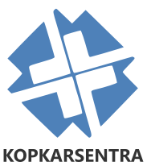
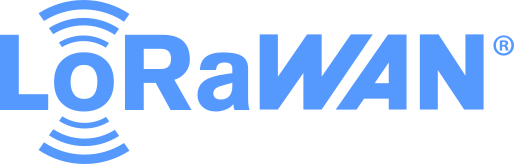

  <h1>𝐇𝐢 𝐭𝐡𝐞𝐫𝐞, 𝐖𝐞'𝐫𝐞 𝐎𝐧𝐲𝐞𝐭. 🙊</h1>
  <h5></h5>
  

 

# 🔭 We're currently working on

| Egrotek | Kopkarsentra | Mefomart | SPM Purwokerto | Aksi FM | LoraWAN |
| ------------- | ------------- | ------------- | ------------- | ------------- | ------------- |
|  |  |  |  | <a href="http://aksifm.com">AksiFM 93.9 MHz</a> |  |

Note : The list above leads to the official website of the project holder we are working on. It's not their site that we work on.

# 🌱 We're currently learning

- [Angular](https://angular.io) - We ❤ this framework, because fast, automation, powerfull, incredible tooling, and we can build apps for any deployment target. For web, mobile web, native mobile and native desktop.
- [Ionic Frameworks](https://ionicframework.com) - We're starting to fall in ❤ with this framework, because it uses Angular. And all components are ready to use.
- [Bootstrap](https://getbootstrap.com) - The world’s most popular front-end open source toolkit, featuring Sass variables and mixins, responsive grid system, extensive prebuilt components, and powerful JavaScript plugins.
- [Firebase](https://firebase.google.com) - We learned about it to understand NoSQL and Realtime Database. But for now, we are only using it for temporary data storage.
- [Jitsi](https://jitsi.org) - We ❤ jitsi because it's so easy to learn, whether it's creating your own jitsi server or integrating with applications.
- [Symfony PHP](https://symfony.com) - Symfony is a set of reusable PHP components. For the purposes of the PHP backend, we fall to Symfony or choose to use PHP natively.
- [MQTT](https://mqtt.org) - We learned how to build a MQTT server with several brokers (mosquitto, EMQX, etc). We really like how MQTT works.
- [Arduino](https://www.arduino.cc) - Sometimes, you have to try to get into the realm of hardware to have a deeper understanding of how computers work.
- [Dragino](https://www.dragino.com) - We use Dragino as Gateway for all Arduino devices connected using Lora.

# 🛠 We use tools

### Code 🐱‍💻

- [Visual Studio Code](https://code.visualstudio.com) ❤
- [XCode](https://developer.apple.com/xcode)
- [Android Studio](https://developer.android.com/studio)
- [Notepad++](https://notepad-plus-plus.org)
- [NodeJS](https://nodejs.org)
- [Nano](https://www.nano-editor.org)
- [Arduino IDE](https://www.arduino.cc/en/Main/Software)
- [Sublime Text 3 Free](https://www.sublimetext.com)

### Design 🐱‍👤

- [InkScape](https://inkscape.org) ❤
- [Figma](https://www.figma.com)
- [Sketch](https://www.sketch.com)
- [Adobe XD](https://www.adobe.com/products/xd.html)

# 🤔 We're looking for help

- [OnyetCBT](https://github.com/onyet/onyetcbt) - <b>Alpha:</b> Computer Base Test for SD, SPM, SMA (Primary, Junior & Senior High School).
- [Shareku Web Test](https://github.com/onyet/shareku) - <b>Alpha:</b> Free File Sharing without Ads.

# 💬 Ask us & 📫 How to reach us

If you have any questions, please contact us via email.

- [admin@shareku.net](mailto:admin@shareku.net)
- [onyet@shareku.net](mailto:onyet@shareku.net)
- [mutelitcorp@gmail.com](mailto:mutelitcorp@gmail.com)

# 🎁 Donate

If you think that what we have developed is useful for you, feel free to buy us a cup of coffee.

- <a href="https://saweria.co/onyet"> Saweria</a>
- 

# 😄 Pronouns: <b>We/Our/Us</b>

- Dian Mukti Wibowo 
- Farda Fitriyanti 

# ⚡ Fun fact

We work to be happy. but we also enjoy all the workloads at hand. ✨😉🤦‍♂️🤦‍♀️
<b>We are very grateful for what God has given us. And we hope you are also grateful every time for what we have received.</b>
